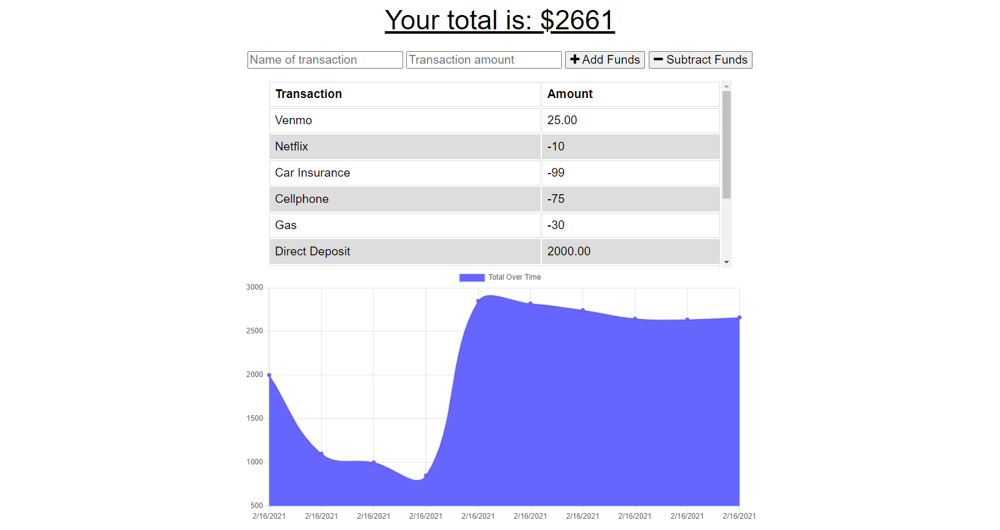

# Budget Tracker

A Budget Tracker application that allows for offline access and functionality. The user will be able to add expenses and deposits to their budget with or without a connection.

## Table of Contents
* [Deployment](#deployment)
* [Built With](#built-with)
* [Installation](#installation)
* [Usage](#usage)
* [Authors](#authors)
* [License](#license)
* [Acknowledgements](#acknowledgement)

## Deployment

Deployed Website: https://rosa-workout-tracker.herokuapp.com/

## Built With

* HTML
* CSS
* JavaScript
* Mongo DB
* Mongoose
* Express
* Node

## Installation 

* npm i
* npm i express
* npm i mongoose
* npm i morgan
* npm i compression
* npm start

## Usage

The user will be able to add expenses and deposits to their budget with or without a connection. When entering transactions offline, they should populate the total when brought back online.

Offline Functionality:

* Enter deposits offline
* Enter expenses offline

When brought back online:

* Offline entries should be added to tracker.

## Authors

  - **Jennifer Rosa**
    [Rosajen27](https://rosajen27.github.io/)

## License

This project is licensed under the MIT License.

Copyright (c) 2020 Jennifer Rosa

Permission is hereby granted, free of charge, to any person obtaining a copy
of this software and associated documentation files (the "Software"), to deal
in the Software without restriction, including without limitation the rights
to use, copy, modify, merge, publish, distribute, sublicense, and/or sell
copies of the Software, and to permit persons to whom the Software is
furnished to do so, subject to the following conditions:

The above copyright notice and this permission notice shall be included in all
copies or substantial portions of the Software.

THE SOFTWARE IS PROVIDED "AS IS", WITHOUT WARRANTY OF ANY KIND, EXPRESS OR
IMPLIED, INCLUDING BUT NOT LIMITED TO THE WARRANTIES OF MERCHANTABILITY,
FITNESS FOR A PARTICULAR PURPOSE AND NONINFRINGEMENT. IN NO EVENT SHALL THE
AUTHORS OR COPYRIGHT HOLDERS BE LIABLE FOR ANY CLAIM, DAMAGES OR OTHER
LIABILITY, WHETHER IN AN ACTION OF CONTRACT, TORT OR OTHERWISE, ARISING FROM,
OUT OF OR IN CONNECTION WITH THE SOFTWARE OR THE USE OR OTHER DEALINGS IN THE
SOFTWARE.

## Acknowledgements

* Trilogy Education Services